# create-dmg-ts

> Create a professional, good-looking [DMG](https://en.wikipedia.org/wiki/Apple_Disk_Image) for your macOS application in seconds

[](https://github.com/Romerolweb/create-dmg-ts/actions)
[](https://nodejs.org)
[](https://www.typescriptlang.org/)

## Overview

create-dmg-ts is a TypeScript-based command-line tool that automates the creation of professional DMG disk images for macOS applications. It handles all the complexity of DMG creation, including:

- 🎨 **Beautiful Design**: Automatic background, icon composition, and layout
- 🔐 **Code Signing**: Automatic signing with Developer ID certificates
- 📦 **Zero Configuration**: Works out of the box with sensible defaults
- ⚡ **Fast**: Creates production-ready DMGs in seconds
- 🛡️ **Type Safe**: Built with TypeScript for reliability


## What Does It Do?

Imagine you have finished building a macOS application, exported it from Xcode, and now want to distribute it to users. The most common distribution method outside the Mac App Store is through a `.dmg` file. However, DMGs are notoriously difficult to create with professional appearance and proper signing.

**create-dmg-ts solves this by:**

1. **Automatic Icon Composition**: Combines your app icon with the macOS disk icon
2. **Professional Layout**: Pre-designed background and optimal window sizing
3. **Drag-to-Install**: Users simply drag your app to Applications
4. **Code Signing**: Automatically signs the DMG with your Developer ID
5. **License Agreement Support**: Optionally includes software license agreements


## Installation

Requires [Node.js](https://nodejs.org) version 24 or later.

```bash
npm install --global create-dmg-ts
```

Or use directly with `npx`:

```bash
npx create-dmg-ts YourApp.app
```

## Quick Start

### Basic Usage

```bash
# Create a DMG in the current directory
create-dmg YourApp.app

# Specify a destination directory
create-dmg YourApp.app ./dist

# Overwrite existing DMG
create-dmg --overwrite YourApp.app
```

### Common Options

```bash
# Exclude version from filename
create-dmg --no-version-in-filename YourApp.app

# Use a specific signing identity
create-dmg --identity="Developer ID Application: Your Name" YourApp.app

# Skip code signing (for testing)
create-dmg --no-code-sign YourApp.app

# Custom DMG title
create-dmg --dmg-title="My Awesome App" YourApp.app
```

## CLI Reference

```
Usage
  $ create-dmg <app> [destination]

Arguments
  <app>           Path to your .app bundle (required)
  [destination]   Output directory (default: current directory)

Options
  --overwrite                  Overwrite existing DMG with the same name
  --no-version-in-filename     Exclude version number from DMG filename
  --identity=<value>           Code signing identity (auto-detected by default)
  --dmg-title=<value>          DMG title (max 27 characters) [default: app name]
  --no-code-sign               Skip code signing the DMG

Examples
  $ create-dmg Lungo.app
  $ create-dmg Lungo.app Build/Releases
  $ create-dmg --overwrite --identity="Developer ID Application" MyApp.app
```

## How It Works

```mermaid
sequenceDiagram
    participant User
    participant CLI as create-dmg
    participant App as YourApp.app
    participant DMG as DMG Builder
    participant Sign as Code Signing
    participant Output as YourApp.dmg

    User->>CLI: create-dmg YourApp.app
    CLI->>App: Read Info.plist
    CLI->>App: Extract app icon
    CLI->>DMG: Compose custom disk icon
    DMG->>DMG: Create DMG with layout
    DMG->>Sign: Sign DMG
    Sign->>Output: Signed DMG created
    Output->>User: ✅ YourApp 1.0.0.dmg
```



### Architecture


## DMG Output

The generated DMG has the following characteristics:

- **Filename Format**: `App Name 1.0.0.dmg` (version can be excluded with flag)
- **Window Size**: 660×400 pixels (optimized for visibility)
- **Icon Size**: 160 pixels (large and clear)
- **File System**: APFS (requires macOS 10.13+)
- **Format**: ULFO compressed (requires macOS 10.11+)
- **Background**: Professional gradient background


### DMG Icon Composition

When your app includes an icon, create-dmg automatically creates a custom disk icon by compositing your app icon onto the macOS disk icon:


**Requirements**: [GraphicsMagick](http://www.graphicsmagick.org) must be installed for icon composition.

```bash
# Install via Homebrew
brew install graphicsmagick imagemagick
```

If GraphicsMagick is not installed, create-dmg falls back to the standard macOS disk icon.

## Code Signing

create-dmg automatically signs the DMG with your Developer ID certificate. The tool:

1. **Auto-detects** available signing identities in your Keychain
2. **Prioritizes** "Developer ID Application" certificates (for distribution)
3. **Falls back** to development certificates if no Developer ID is found
4. **Reports** the signing identity used


### Important Notes on Code Signing

- ✅ **DMG signing is automatic** when a valid certificate is found
- ⚠️ **Notarization is NOT automatic** - you must notarize separately (see [Code Signing Guide](docs/code-signing.md))
- 🔐 **Developer ID required** for distribution outside the Mac App Store
- 🧪 **Use `--no-code-sign`** for testing without certificates

**See**: [Complete Code Signing Guide](docs/code-signing.md) for detailed instructions on:
- Obtaining Developer ID certificates
- Notarizing your DMG
- App Store vs Direct Distribution
- Troubleshooting signing issues

## Software License Agreement

create-dmg can automatically add a Software License Agreement (SLA) to your DMG. When users mount the DMG, they must agree to the license before the disk image mounts.

### Supported License Files

Place one of these files in the **same directory** as your app:

- `license.txt` - Plain text license
- `license.rtf` - Rich Text Format license  
- `sla.r` - Raw SLAResources file ([download template](https://download.developer.apple.com/Developer_Tools/software_licensing_for_udif/slas_for_udifs_1.0.dmg))

create-dmg automatically detects and includes the license.

### Requirements

- `/usr/bin/rez` must be installed (from [Command Line Tools for Xcode](https://developer.apple.com/download/more/))

```bash
# Verify rez is installed
which rez
# Should output: /usr/bin/rez
```

## Development

### Building from Source

```bash
# Clone the repository
git clone https://github.com/Romerolweb/create-dmg-ts.git
cd create-dmg-ts

# Install dependencies (requires macOS)
npm install

# Build TypeScript
npm run build

# Run tests
npm test

# Run linter
npm run lint
```

### Project Structure

```
create-dmg-ts/
├── src/
│   ├── cli.ts              # CLI entry point and main logic
│   ├── compose-icon.ts     # Icon composition utilities
│   ├── sla.ts              # Software License Agreement handling
│   ├── types/              # TypeScript type definitions
│   └── *.test.ts           # Unit and integration tests
├── docs/
│   ├── ADR/                # Architecture Decision Records
│   └── code-signing.md     # Code signing documentation
├── assets/                 # DMG background and resources
├── dist/                   # Compiled JavaScript output
└── package.json
```

### TypeScript Configuration

The project uses strict TypeScript settings:

- **Target**: ES2022
- **Module**: Node16 (ESM)
- **Strict Mode**: Enabled
- **Type Checking**: Comprehensive (no implicit any, unused vars, etc.)

See [`tsconfig.json`](tsconfig.json) for complete configuration.

### Code Quality

```bash
# Type checking
npm run typecheck

# Linting
npm run lint

# Auto-fix linting issues
npm run lint:fix

# Run all checks (typecheck + lint + test)
npm run build && npm test
```

### Pre-commit Hooks

The project uses Husky to enforce code quality:

- **Type checking** runs on every commit
- **Linting** runs on staged files via lint-staged
- Commits are blocked if checks fail

## Architecture Decision Records

This project documents significant architectural decisions in [Architecture Decision Records (ADRs)](docs/ADR/). Key decisions include:

- [ADR-001: Migration to TypeScript](docs/ADR/001-typescript-migration.md)
- [ADR-002: Node.js Version Update to v24](docs/ADR/002-nodejs-version-update.md)
- [ADR-003: ESLint and Code Quality Tooling](docs/ADR/003-eslint-and-code-quality.md)
- [ADR-004: Testing Infrastructure](docs/ADR/004-testing-infrastructure.md)

## Platform Requirements

- **Operating System**: macOS only (uses macOS-specific tools)
- **Node.js**: Version 24 or later
- **Command Line Tools**: Xcode Command Line Tools must be installed
- **Optional**: GraphicsMagick for custom icon composition

### Why macOS Only?

DMG creation relies on macOS-native utilities:
- `hdiutil` - Disk image manipulation
- `/usr/bin/rez` - Resource compiler (for license agreements)
- `codesign` - Code signing utility
- `security` - Certificate management

These tools are only available on macOS.

## Comparison with create-dmg (JavaScript)

This project is a TypeScript evolution of the original [create-dmg](https://github.com/sindresorhus/create-dmg) by Sindre Sorhus.

### What's Different?

| Feature | create-dmg (JS) | create-dmg-ts |
|---------|----------------|---------------|
| **Language** | JavaScript | TypeScript |
| **Type Safety** | No | Yes (strict mode) |
| **Node.js Version** | 18+ | 24+ |
| **Testing** | AVA | Node.js test runner |
| **Linting** | xo | ESLint with TypeScript |
| **Pre-commit Hooks** | No | Yes (Husky) |
| **Documentation** | Basic | Comprehensive with Mermaid |
| **ADRs** | No | Yes |

## Troubleshooting

### "macOS only" Error

**Cause**: create-dmg requires macOS-specific tools.

**Solution**: This tool only works on macOS. For other platforms, consider using virtualization or CI/CD services that provide macOS runners.

### "Could not find app" Error

**Cause**: The specified path does not point to a valid `.app` bundle.

**Solution**: Ensure the path points to a `.app` directory and includes the `.app` extension.

```bash
# Correct
create-dmg YourApp.app

# Incorrect
create-dmg YourApp
```

### "DMG title cannot exceed 27 characters"

**Cause**: The app name (or `--dmg-title`) is too long.

**Solution**: Use `--dmg-title` with a shorter name:

```bash
create-dmg --dmg-title="MyApp" VeryLongApplicationName.app
```

This is a limitation in the underlying `node-appdmg` library.

### Code Signing Issues

See the [Code Signing Guide](docs/code-signing.md#troubleshooting) for comprehensive troubleshooting.

## Contributing

Contributions are welcome! Please follow these guidelines:

1. **Fork** the repository
2. **Create** a feature branch (`git checkout -b feature/amazing-feature`)
3. **Make** your changes with clear commit messages
4. **Ensure** tests pass (`npm test`)
5. **Ensure** linting passes (`npm run lint`)
6. **Ensure** type checking passes (`npm run typecheck`)
7. **Submit** a pull request

### Code Style

- Follow existing TypeScript patterns
- Use strict typing (avoid `any`)
- Add JSDoc comments for public APIs
- Write tests for new features
- Update documentation as needed

## License

MIT © [Sindre Sorhus](https://sindresorhus.com) (original create-dmg)

MIT © [Romerolweb](https://github.com/Romerolweb) (TypeScript version)

## Related Projects

- [Defaults](https://github.com/sindresorhus/Defaults) - Swifty and modern UserDefaults
- [LaunchAtLogin](https://github.com/sindresorhus/LaunchAtLogin) - Add "Launch at Login" functionality
- [node-appdmg](https://github.com/LinusU/node-appdmg) - DMG creation library (used internally)

## Credits

- Original concept and JavaScript implementation: [Sindre Sorhus](https://sindresorhus.com)
- TypeScript migration and enhancements: [Romerolweb](https://github.com/Romerolweb)
- Icon composition logic: GraphicsMagick and ImageMagick communities
- DMG creation: [node-appdmg](https://github.com/LinusU/node-appdmg)

---

**Need help?** 
- 📖 [Read the Code Signing Guide](docs/code-signing.md)
- 🐛 [Report an issue](https://github.com/Romerolweb/create-dmg-ts/issues)
- 💬 [Start a discussion](https://github.com/Romerolweb/create-dmg-ts/discussions)
