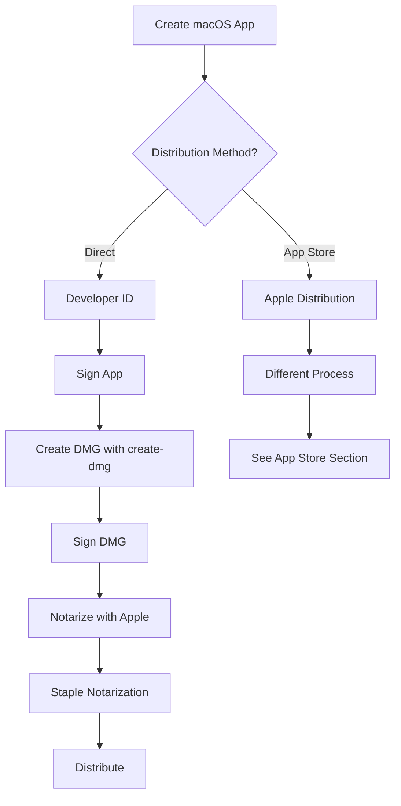
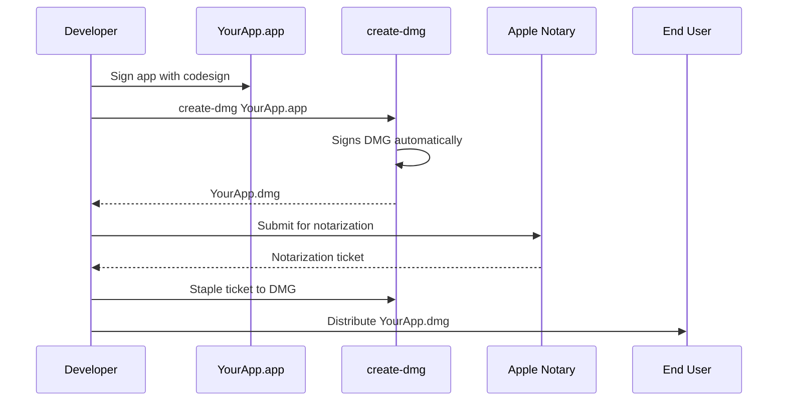
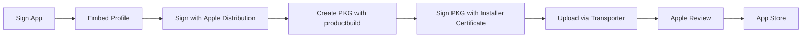

# macOS Code Signing Guide

This guide explains how to sign DMG files created with `create-dmg`. Understanding macOS code signing is essential for distributing applications professionally.

## Table of Contents

- [Overview](#overview)
- [Signing Methods Comparison](#signing-methods-comparison)
- [Developer ID Distribution (Supported)](#developer-id-distribution-supported)
- [App Store Distribution (Not Directly Supported)](#app-store-distribution-not-directly-supported)
- [Certificate Management](#certificate-management)
- [Troubleshooting](#troubleshooting)
- [References](#references)

## Overview

macOS uses code signing to verify the identity of software developers and ensure applications have not been tampered with. When users download and run your application, macOS checks the code signature to determine whether to allow execution.



## Signing Methods Comparison

### What create-dmg Supports

✅ **Developer ID Application Signing**
- For direct distribution outside the Mac App Store
- Users can install without warnings (when notarized)
- create-dmg automatically signs the DMG with your Developer ID certificate
- Recommended for most independent developers

✅ **Local Development Signing**
- "Mac Developer" or "Apple Development" certificates
- For testing and development purposes
- Does not require notarization
- Users may see warnings when installing

### What create-dmg Does NOT Support

❌ **App Store Submission Process**
- create-dmg creates DMG files for direct distribution
- App Store apps are submitted as `.pkg` files through App Store Connect
- Different certificate type required: "Apple Distribution" (not "Developer ID")
- Requires provisioning profiles and sandboxing
- Must be uploaded via Transporter or Xcode
- See [App Store Distribution](#app-store-distribution-not-directly-supported) for details

❌ **Automated Notarization**
- create-dmg signs the DMG but does not notarize it
- You must notarize the DMG separately using `notarytool`
- See [Notarization](#notarization) section below

## Developer ID Distribution (Supported)

This is the primary use case for create-dmg: creating signed DMG files for direct distribution.

### Prerequisites

1. **Apple Developer Program Membership** ($99/year)
   - Source: [Apple Developer Program](https://developer.apple.com/programs/)
2. **Developer ID Application Certificate**
   - Obtained from [Apple Developer Console](https://developer.apple.com/account/resources/certificates/list)
3. **Signed macOS Application**
   - Your `.app` bundle must be signed before creating the DMG

### Workflow Overview



### Step 1: Sign Your Application

Before creating the DMG, ensure your application is properly signed:

```bash
# Sign the application bundle
codesign --sign "Developer ID Application: Your Name (TEAM_ID)" \
         --options runtime \
         --entitlements entitlements.plist \
         --timestamp \
         --deep \
         -v YourApp.app

# Verify the signature
codesign --verify --deep --strict --verbose=2 YourApp.app
```

**Required Entitlements for Direct Distribution:**

```xml
<?xml version="1.0" encoding="UTF-8"?>
<!DOCTYPE plist PUBLIC "-//Apple//DTD PLIST 1.0//EN" 
  "http://www.apple.com/DTDs/PropertyList-1.0.dtd">
<plist version="1.0">
<dict>
    <!-- Sandbox: Disabled for direct distribution -->
    <key>com.apple.security.app-sandbox</key>
    <false/>

    <!-- Hardened Runtime Exceptions -->
    <!-- Required for apps using JIT compilation or WebKit -->
    <key>com.apple.security.cs.allow-jit</key>
    <true/>
    <key>com.apple.security.cs.allow-unsigned-executable-memory</key>
    <true/>
    <key>com.apple.security.cs.disable-library-validation</key>
    <true/>
</dict>
</plist>
```

Source: [Hardened Runtime](https://developer.apple.com/documentation/security/hardened_runtime)

### Step 2: Create and Sign DMG

```bash
# create-dmg will automatically sign the DMG
create-dmg YourApp.app

# To use a specific signing identity:
create-dmg --identity="Developer ID Application: Your Name (TEAM_ID)" YourApp.app

# To skip code signing entirely (for testing):
create-dmg --no-code-sign YourApp.app
```

The tool automatically:
1. Detects your Developer ID certificate
2. Signs the DMG file
3. Verifies the signature
4. Reports the signing identity used

### Step 3: Notarization

**Important:** Notarization is required for DMGs distributed outside the App Store on macOS 10.15 (Catalina) and later.

#### Setup Notarization Credentials

```bash
# Store credentials securely in Keychain
xcrun notarytool store-credentials "NotaryProfile" \
  --apple-id "your-email@example.com" \
  --team-id "TEAM_ID" \
  --password "xxxx-xxxx-xxxx-xxxx"
```

The password must be an **app-specific password**, not your Apple ID password. Generate one at [appleid.apple.com](https://appleid.apple.com).

Source: [Customizing the Notarization Workflow](https://developer.apple.com/documentation/security/notarizing_macos_software_before_distribution/customizing_the_notarization_workflow)

#### Submit for Notarization

```bash
# Submit the signed DMG
xcrun notarytool submit "YourApp 1.0.0.dmg" \
  --keychain-profile "NotaryProfile" \
  --wait

# Check history if needed
xcrun notarytool history --keychain-profile "NotaryProfile"
```

The `--wait` flag causes the command to wait for notarization to complete (typically 2-5 minutes).

#### Staple the Notarization Ticket

```bash
# Attach the notarization ticket to the DMG
xcrun stapler staple "YourApp 1.0.0.dmg"

# Verify the stapled ticket
xcrun stapler validate "YourApp 1.0.0.dmg"
```

Stapling embeds the notarization ticket in the DMG so it works offline.

Source: [Notarizing macOS Software Before Distribution](https://developer.apple.com/documentation/security/notarizing_macos_software_before_distribution)

#### Verify Gatekeeper Acceptance

```bash
# Test that Gatekeeper will accept the DMG
spctl --assess --type open --context context:primary-signature -v "YourApp 1.0.0.dmg"
```

Expected output: `accepted`

### Complete Script Example

```bash
#!/bin/bash
set -e

APP_NAME="YourApp"
VERSION="1.0.0"
IDENTITY="Developer ID Application: Your Name (TEAM_ID)"
NOTARY_PROFILE="NotaryProfile"

echo "📝 Signing application..."
codesign --sign "$IDENTITY" \
  --options runtime \
  --entitlements entitlements.plist \
  --timestamp \
  --deep \
  -v "$APP_NAME.app"

echo "📦 Creating DMG..."
create-dmg --identity="$IDENTITY" "$APP_NAME.app"

DMG_FILE="$APP_NAME $VERSION.dmg"

echo "☁️  Submitting for notarization..."
xcrun notarytool submit "$DMG_FILE" \
  --keychain-profile "$NOTARY_PROFILE" \
  --wait

echo "📎 Stapling notarization ticket..."
xcrun stapler staple "$DMG_FILE"

echo "🔍 Verifying..."
xcrun stapler validate "$DMG_FILE"
spctl --assess --type open --context context:primary-signature -v "$DMG_FILE"

echo "✅ Complete! Ready to distribute: $DMG_FILE"
```

## App Store Distribution (Not Directly Supported)

The create-dmg tool is designed for **direct distribution** and is **not suitable for App Store submission**. App Store distribution requires a fundamentally different process.

### Why Not App Store?

1. **Different Certificate Type**: App Store requires "Apple Distribution" certificates, not "Developer ID"
2. **Different Format**: App Store requires `.pkg` files, not `.dmg` files
3. **Mandatory Sandboxing**: All App Store apps must enable the App Sandbox
4. **Provisioning Profiles**: App Store apps require embedded provisioning profiles
5. **Different Toolchain**: Use `productbuild` instead of `create-dmg`
6. **Submission Method**: Upload via Transporter or Xcode, not direct distribution

### App Store Workflow Overview

For reference, here is the App Store submission workflow (which does not use create-dmg):



### Required Certificates for App Store

You need **two** certificates:

1. **Apple Distribution** (formerly "Mac App Distribution")
   - For signing the application bundle
   - Used with `codesign` command
   
2. **Mac Installer Distribution** (formerly "3rd Party Mac Developer Installer")
   - For signing the installer package (`.pkg`)
   - Used with `productbuild --sign` command

Source: [Distributing Apps on the Mac App Store](https://developer.apple.com/documentation/xcode/distributing-your-app-for-beta-testing-and-releases)

### App Store Entitlements

App Store apps have different entitlement requirements:

```xml
<?xml version="1.0" encoding="UTF-8"?>
<!DOCTYPE plist PUBLIC "-//Apple//DTD PLIST 1.0//EN" 
  "http://www.apple.com/DTDs/PropertyList-1.0.dtd">
<plist version="1.0">
<dict>
    <!-- Sandbox: MANDATORY for App Store -->
    <key>com.apple.security.app-sandbox</key>
    <true/>

    <!-- Network Access -->
    <key>com.apple.security.network.client</key>
    <true/>

    <!-- File Access: User-selected files -->
    <key>com.apple.security.files.user-selected.read-write</key>
    <true/>

    <!-- File Access: Downloads folder -->
    <key>com.apple.security.files.downloads.read-write</key>
    <true/>
</dict>
</plist>
```

Source: [App Sandbox](https://developer.apple.com/documentation/security/app-sandbox)

### App Store Signing Commands

For reference (not used with create-dmg):

```bash
# 1. Embed provisioning profile
cp embedded.provisionprofile "YourApp.app/Contents/embedded.provisionprofile"

# 2. Sign the app with Apple Distribution certificate
codesign --sign "Apple Distribution: Your Name (TEAM_ID)" \
  --options runtime \
  --entitlements entitlements.plist \
  --timestamp \
  --deep \
  -v YourApp.app

# 3. Create signed installer package
productbuild --sign "3rd Party Mac Developer Installer: Your Name (TEAM_ID)" \
  --component YourApp.app /Applications \
  YourApp.pkg

# 4. Upload via Transporter or Xcode
# This is done through Apple's tools, not command line
```

### Key Differences Summary

| Aspect | Developer ID (create-dmg) | App Store |
|--------|---------------------------|-----------|
| **Tool** | create-dmg | productbuild |
| **Format** | `.dmg` | `.pkg` |
| **Certificate** | Developer ID Application | Apple Distribution |
| **Installer Cert** | N/A (optional) | Mac Installer Distribution |
| **Sandbox** | Optional (usually disabled) | Mandatory (enabled) |
| **Provisioning** | Not required | Required |
| **Notarization** | Manual (xcrun notarytool) | Handled by App Store |
| **Distribution** | Direct download | Mac App Store |
| **Submission** | N/A | Transporter/Xcode |

## Certificate Management

### Obtaining Developer ID Certificates

1. Log in to [Apple Developer Console](https://developer.apple.com/account/)
2. Navigate to **Certificates, Identifiers & Profiles**
3. Click the **+** button to create a new certificate
4. Select **Developer ID Application** under the "Software" section
5. Follow the prompts to upload a Certificate Signing Request (CSR)
6. Download and install the certificate

### Creating a Certificate Signing Request (CSR)

If you do not have a CSR:

1. Open **Keychain Access** on macOS
2. Menu: **Keychain Access** → **Certificate Assistant** → **Request a Certificate from a Certificate Authority**
3. Enter your email address
4. Select "Saved to disk"
5. Save the `CertificateSigningRequest.certSigningRequest` file

Source: [Create a Certificate Signing Request](https://developer.apple.com/help/account/create-certificates/create-a-certificate-signing-request)

### Verifying Installed Certificates

```bash
# List all code signing identities
security find-identity -v -p codesigning

# Expected output includes:
# 1) ABC123... "Developer ID Application: Your Name (TEAM_ID)"
```

### Certificate Types Overview

| Certificate Type | Use Case | Used By |
|-----------------|----------|---------|
| Developer ID Application | Direct distribution (DMG, ZIP) | create-dmg ✅ |
| Apple Distribution | Mac App Store distribution | Not supported ❌ |
| Mac Developer | Local development/testing | Supported (dev only) |
| Apple Development | Local development/testing | Supported (dev only) |

## Troubleshooting

### "No suitable code signing identity found"

**Cause**: create-dmg cannot find a valid code signing certificate in your Keychain.

**Solutions**:
1. Verify certificates are installed: `security find-identity -v -p codesigning`
2. Ensure you have a "Developer ID Application" certificate
3. Manually specify identity: `create-dmg --identity="Developer ID Application: Your Name"`
4. Skip signing for testing: `create-dmg --no-code-sign YourApp.app`

### "Code signing failed" with exit code 2

**Cause**: The DMG was created but code signing encountered an error.

**Solutions**:
1. Check that your certificate is not expired
2. Verify your certificate's private key is in your Keychain
3. Try signing manually: `codesign --sign "Developer ID Application" path/to/app.dmg`
4. Review detailed error messages in the output

### Notarization Fails

**Cause**: Apple's notary service rejected the submission.

**Solutions**:
1. Check notarization log: `xcrun notarytool log <submission-id> --keychain-profile NotaryProfile`
2. Common issues:
   - Missing or invalid code signature
   - Unsigned frameworks or helper executables
   - Invalid entitlements
   - Use of deprecated APIs
3. Fix issues and resubmit

### "The app is damaged and can't be opened"

**Cause**: Quarantine attribute or invalid signature.

**For testing only**, remove quarantine:
```bash
xattr -cr YourApp.app
```

**For distribution**: Ensure proper signing and notarization.

## References

### Official Apple Documentation

- [Code Signing Guide](https://developer.apple.com/library/archive/documentation/Security/Conceptual/CodeSigningGuide/)
- [Notarizing macOS Software](https://developer.apple.com/documentation/security/notarizing_macos_software_before_distribution)
- [Hardened Runtime](https://developer.apple.com/documentation/security/hardened_runtime)
- [App Sandbox](https://developer.apple.com/documentation/security/app-sandbox)
- [Distributing Apps Outside the Mac App Store](https://developer.apple.com/documentation/xcode/distributing-your-app-to-registered-devices)
- [Mac App Store Submission](https://developer.apple.com/documentation/xcode/distributing-your-app-for-beta-testing-and-releases)

### Apple Developer Resources

- [Apple Developer Program](https://developer.apple.com/programs/)
- [Certificates, Identifiers & Profiles](https://developer.apple.com/account/resources/certificates/list)
- [App Store Connect](https://appstoreconnect.apple.com/)

### Command Line Tools

- `codesign` - Sign and verify code signatures
- `security` - Manage keychains and certificates
- `xcrun notarytool` - Submit software for notarization
- `xcrun stapler` - Attach notarization tickets
- `spctl` - System Policy security assessment
- `productbuild` - Create installer packages (for App Store)

---

**Note**: This guide focuses on what create-dmg supports: Developer ID signing for direct distribution. For App Store distribution, consult Apple's official App Store submission documentation and use Xcode or `productbuild` instead of create-dmg.
